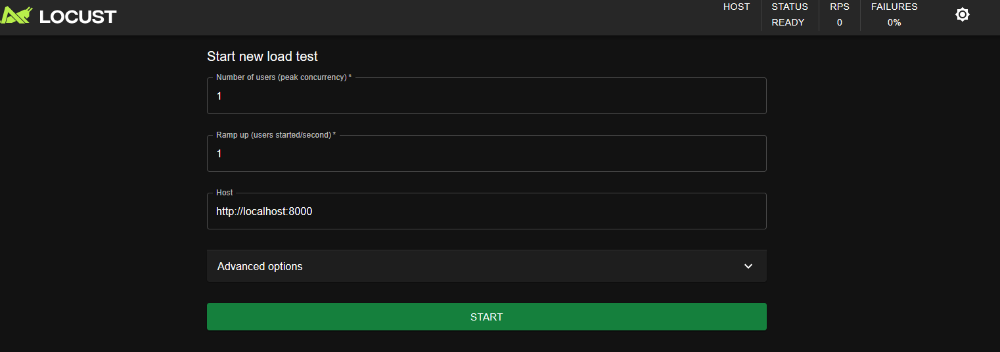

# Locust

## Teste de carga
Um teste de carga é um tipo de teste de software que avalia o comportamento de um sistema sob condições de carga específicas. O teste de carga é realizado para determinar a capacidade de um sistema de lidar com uma quantidade específica de usuários simultâneos ou transações.

## Requisitos
- Python 3.13
- Docker (App rodando via docker compose)

## Install
Para usar o [Locust](https://locust.io/), é necessário configurar um ambiente virtual (venv) e instalar o Locust, execute o comando abaixo:

```python -m venv venv```

```source venv/bin/activate```

```pip install -r requirements.txt```

```locust -f locustfile.py```

# Executando o teste
Após a instalação, acesse o endereço http://localhost:8089/ e informe a quantidade de usuários e a taxa de requisições por segundo.

## Exeplo de preenchimento dos campos


Clique em Start e acessará o dashboard do Locust, terá statistics, charts e etc.